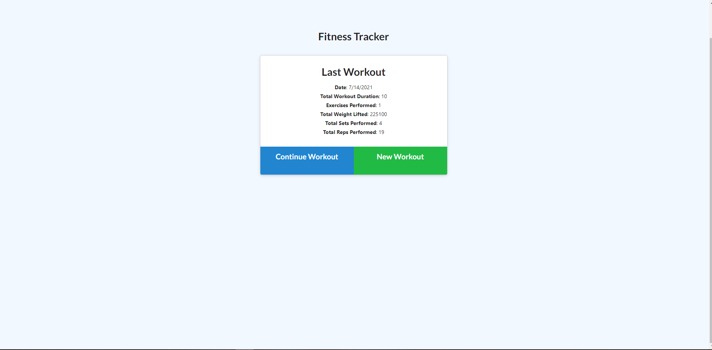
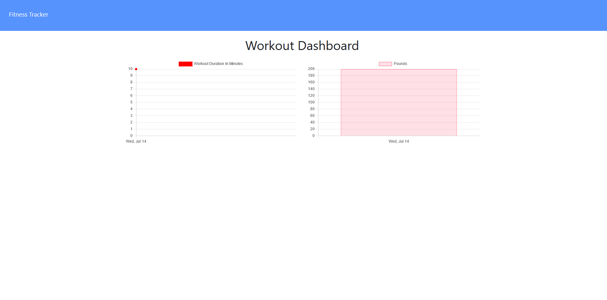
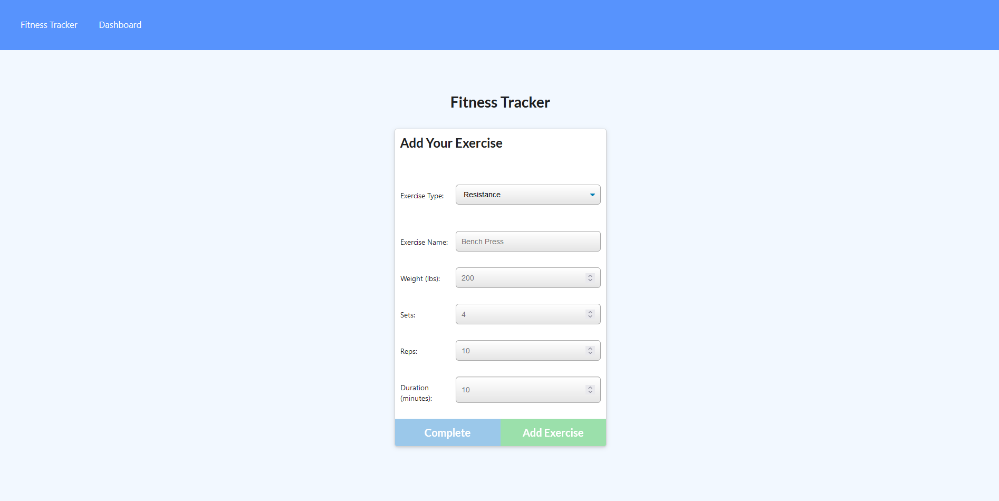

# Fitness tracker

“Push through the Pain. Giving Up Hurts More.” -Vegeta

“Power comes in response to a need, not a desire. You have to create that need.”- Goku

# Table of Contents
<h3>

*[The Description](#description)
*[Criteria](#criteria)
*[Links](#links)
*[Preview](#screenshots)

</h3>

# Description

<h3>This is an app that everyone could use. An app that lets you
<ul>
<li>Input workout data, plan workouts</li>

<li>Update live workouts, HIT NEW GOALS</li>

<li> keeps track of workouts, to help you reach personal goals.</li>
</ul>
 Check it out, and raise your power beyond nine thousand. </h3>

# Criteria: 
<h4><ul>

<li>When the user loads the page, they should be given the option to create a new workout or continue with their last workout.</li>

<li>The user should be able to:

  * Add exercises to the most recent workout plan.

  * Add new exercises to a new workout plan.

  * View the combined weight of multiple exercises from the past seven workouts on the `stats` page.

  * View the total duration of each workout from the past seven workouts on the `stats` page.</li>
</h4>

# Links:

<h5>Github:</h5>
<a href="https://github.com/Staycold/Fitness_tracker" target="_blank">https://github.com/Staycold/Fitness_tracker</a>

<h5>Heroku:</h5>
<a href="https://benefique-chaise-73181.herokuapp.com/?id=60ef3b49d7315c00159d3821 " target="_blank">https://benefique-chaise-73181.herokuapp.com/?id=60ef3b49d7315c00159d3821 </a>

 

 # Screenshots

